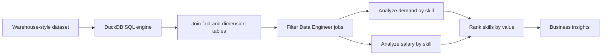
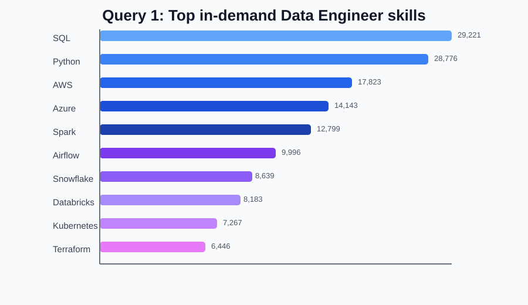
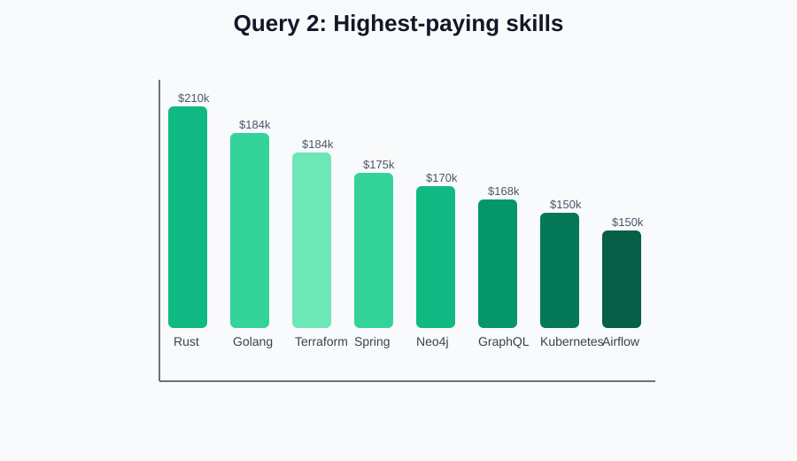
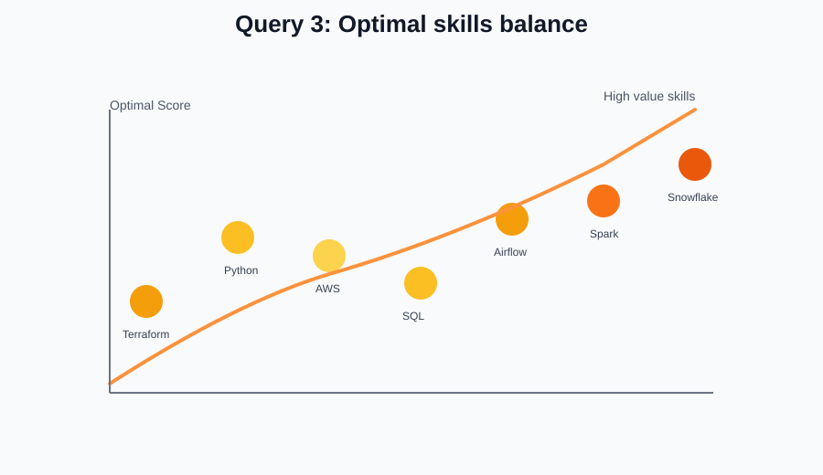

# Data Engineering Job Market Analysis

## Project overview
This is my first data engineering project, and it focuses on analyzing a Data Engineering job market dataset using SQL in DuckDB. The main purpose of the project is not to perform business intelligence work in the traditional analyst sense, but to build a strong foundation in warehouse-style data modeling, SQL querying, and insight generation from structured data.

I worked with a dataset of job postings and related dimension tables, then used SQL to answer practical questions such as:

- Which skills are most in demand for Data Engineers?
- Which skills command the highest salaries?
- Which skills provide the best balance of salary and market demand?

This project helped me practice the core responsibilities of a Data Engineer: understanding data structure, transforming raw data into usable information, and querying a warehouse-style dataset to support decision-making.

## Data warehouse context
The dataset is structured like a modern data warehouse, using a star schema design.

### Star schema
A star schema is a common warehouse pattern where one large fact table stores business events, and several smaller dimension tables provide descriptive attributes.

In this project:

- Fact table: job_postings_fact
  - Contains the main job posting records
  - Stores metrics such as salary, job title, work-from-home flag, and posting details
- Dimension tables:
  - skills_dim
    - Stores skill names and unique skill IDs
  - skills_job_dim
    - Relates jobs to the skills required for each posting

This design is useful because it makes querying easier and allows analysis across multiple business dimensions, such as:

- job title
- salary
- work-from-home status
- required skills

It also reflects how data engineers often work with warehouse data: fact tables for event data and dimension tables for descriptive context.

## Why this project matters
This project is valuable because it shows how a Data Engineer can move from raw structured data to insight using SQL. It helped me practice real warehouse-style thinking, including:

- understanding fact vs. dimension tables
- joining multiple tables to answer business questions
- filtering data by important dimensions
- summarizing large datasets using aggregated metrics
- identifying trends in the job market

It is a beginner-friendly project, but it introduces the kind of analytical thinking used in data engineering and analytics environments.

## Project workflow



## Key questions explored
The project answers three main questions:

1. What are the most in-demand skills for Data Engineers?
2. Which skills have the highest median salaries?
3. Which skills give the best combination of demand and pay?

## Query 1: Most in-demand skills
This query identifies the top skills requested by employers for remote Data Engineer roles.


This query tells us which skills appear most often in hiring requirements for remote Data Engineer jobs.

## Query 2: Highest-paying skills
This query focuses on the median salary for each skill, while also checking how common the skill is in the market.


This query helps identify which skills pay the most, even if they are not always the most common skills in the job market.

## Query 3: Best overall skills balance
This query combines demand and pay to rank the most valuable skills for a Data Engineer to learn.


This final query ranks skills by a practical balance of demand and compensation, which is often the most useful view for career planning.

## Example findings
The SQL analysis showed that high-value and highly sought-after skills include:

- SQL
- Python
- AWS
- Azure
- Spark
- Airflow
- Snowflake
- Databricks
- Kubernetes
- Terraform

These results reflect a modern Data Engineering skill set that includes:

- core data processing skills such as SQL and Python
- cloud engineering knowledge such as AWS and Azure
- orchestration and pipeline tools such as Airflow and Spark
- data warehouse and lakehouse technologies such as Snowflake and Databricks

## Skills I gained from this project
This project helped me build a strong foundation in the following areas:

- SQL fundamentals and query writing
- Using JOINs to connect fact and dimension tables
- GROUP BY and aggregate functions such as COUNT and MEDIAN
- Filtering and segmenting data by real-world business criteria
- Working with a warehouse-style data model
- Understanding star schema concepts and dimensional design
- Translating business questions into SQL logic
- Building confidence with database exploration and analysis
- Using DuckDB for lightweight analytical workloads
- Writing beginner-friendly but practical data engineering queries

## Tools used
- DuckDB
- SQL
- GitHub
- Markdown
- Data warehouse modeling concepts

## Why I did this project first project
This is a strong first project because it combines real-world data, practical Data Engineering workflows, and hands-on SQL problem solving without needing a large production setup.

It taught me how to:

- think in terms of data models
- query data from a warehouse perspective
- explore a dataset systematically
- summarize findings clearly
- connect technical work to real business questions

## Simple visual summary

```text
Data Engineering Skill Landscape

Core skills           -> SQL, Python, Linux, Git
Cloud skills          -> AWS, Azure, GCP
Data tools            -> Spark, Kafka, Airflow
Warehouse / Lakehouse -> Snowflake, Databricks, Redshift

Best overall value   -> SQL + Python + Cloud + Orchestration skills
```

## Final note
This project is a first step in my Data Engineering journey. It helped me move from simply writing SQL to understanding how data is structured in a warehouse, how tables relate to each other, and how to extract useful insight from a real dataset. Even though it is a beginner project, it reflects the kind of data thinking and modeling skills that are important in a Data Engineering role.
